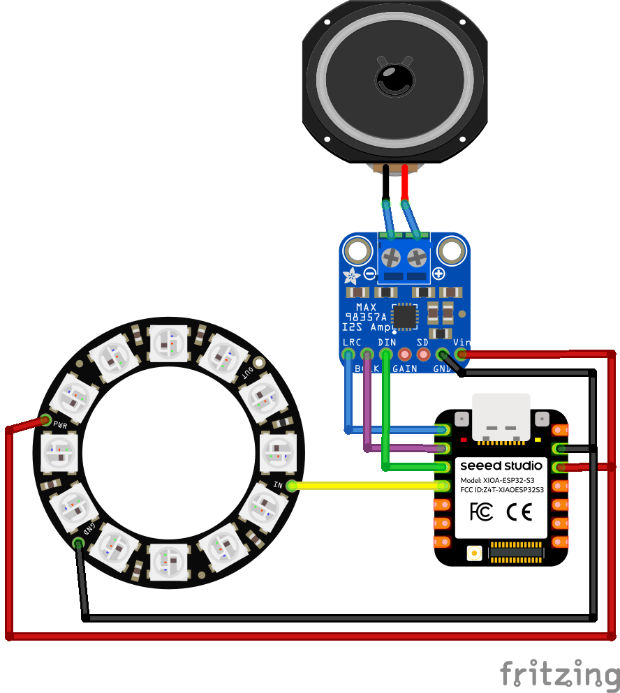
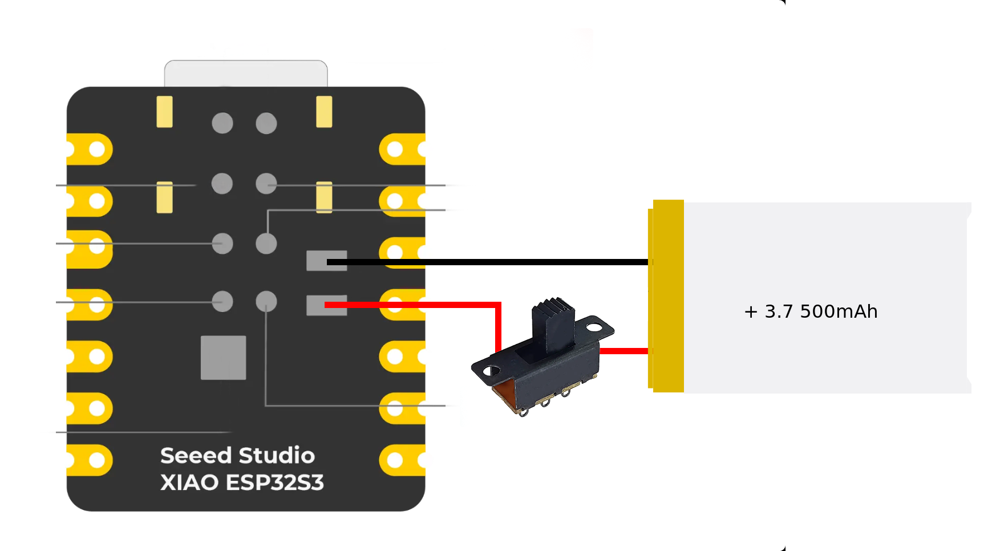

# AI Pendant — XIAO ESP32S3 Sense + Xiaozhi AI

> **Watch the build video:** [How I built this AI Pendant using an ESP32](https://www.youtube.com/watch?v=LWyI_kz2pQo)

A wearable AI pendant built around the **Seeed Studio XIAO ESP32S3 Sense** and the open-source **Xiaozhi AI** firmware. It listens, responds, and can see — all in a 3D printed enclosure small enough to wear.

Watch here:

---

## Features

- 🎙️ PDM microphone for voice input
- 📷 OV2640 camera for visual AI features
- 🔊 I2S amplifier + speaker for voice responses
- 💡 NeoPixel ring light for status feedback
- 📶 Wi-Fi connectivity
- 🔋 Rechargeable LiPo battery
- 🖨️ 3D printed enclosure

---

## Flash the Firmware

No build environment needed — flash directly from your browser:

👉 **[Flash Firmware](https://techtalkies.github.io/flash.html)**

1. Open the link in Chrome or Edge
2. Select the firmware
3. Click **Connect** and select your XIAO ESP32S3's COM port
4. Upload
5. Done — no drivers, no terminal

---

## Hardware

| Component | Link |
|-----------|------|
| Seeed Studio XIAO ESP32S3 Sense | [Buy here](https://www.seeedstudio.com/XIAO-ESP32S3-Sense-p-5639.html?sensecap_affiliate=P9GHEkF&referring_service=link) |
| MAX98357A I2S Amplifier + Speaker | — |
| NeoPixel RGB Ring | — |
| LiPo Battery | — |
| 3D Printed Enclosure | — |

---

## Wiring

### I2S Speaker (MAX98357A)

| XIAO ESP32S3 | MAX98357A |
|--------------|-----------|
| GPIO 3 | DIN (Data) |
| GPIO 2 | BCLK (Bit Clock) |
| GPIO 1 | LRC (Left/Right Clock) |
| 3.3V | VIN |
| GND | GND |

### NeoPixel Ring

| XIAO ESP32S3 | NeoPixel |
|--------------|----------|
| GPIO 4 | DIN (Data In) |
| 3.3V | VIN |
| GND | GND |

---

## License

This project builds on [Xiaozhi ESP32](https://github.com/78/xiaozhi-esp32) — see their repo for license details.

---

*If you found this useful, consider subscribing to [Tech Talkies](https://www.youtube.com/@techtalkies1) for more electronics and DIY tech builds.*

*Made with ☕ and too many brownout resets — [Tech Talkies](https://techtalkies.in)*
