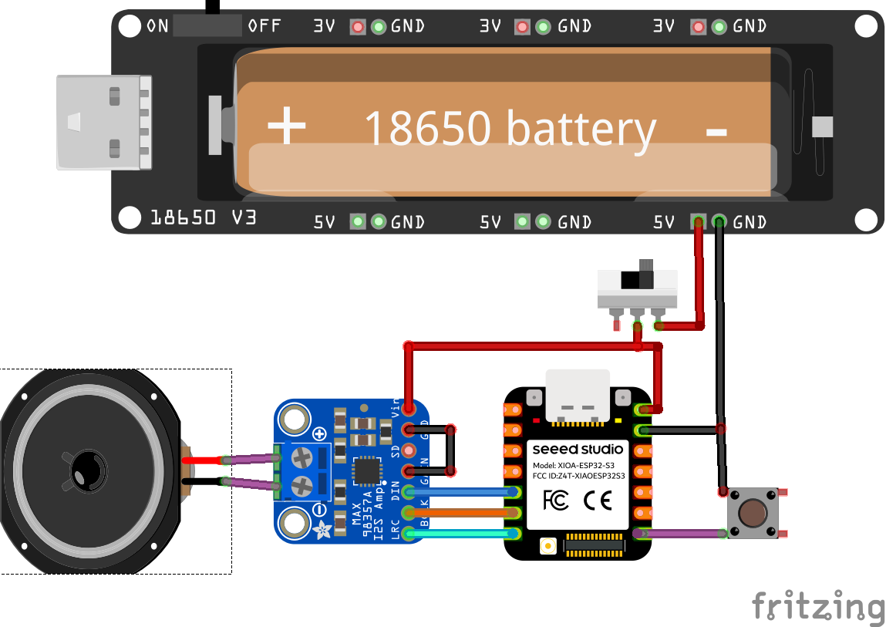

# ESP32S3 ESP-NOW Walkie-Talkie

A low-latency, push-to-talk walkie-talkie built on two **Seeed Studio XIAO ESP32S3 Sense** boards, using **ESP-NOW** for wireless audio and a **MAX98357A** I2S amplifier for output. No WiFi router, no pairing app — just two boards talking directly over 2.4 GHz.

---

Watch here:

[](https://www.youtube.com/watch?v=u1eQ4RQV828)

---

## Features

- **Push-to-talk (PTT)** — hold a button to transmit, release to listen
- **ESP-NOW audio streaming** — direct device-to-device, no access point required
- **Onboard PDM microphone** — uses the XIAO ESP32S3 Sense's built-in mic, no external mic wiring
- **Thread-safe audio ring buffer** — incoming audio is buffered and played back from the main loop, avoiding I2S corruption from the WiFi callback thread
- **Automatic peer identity** — flash the *same* firmware on both boards; each board detects its own MAC address at boot and configures itself as Device 1 or Device 2
- **Periodic link check (ping/pong)** — Device 1 pings every 30s, Device 2 auto-replies; both play a confirmation tone so you know the link is alive
- **Status tones** — startup chime, PTT press/release "roger" beeps, ping success/fail tones, synthesized on the fly (no audio files needed)
- **Software gain with clipping protection** — adjustable mic gain, hard-clamped to prevent overflow distortion

---

## Hardware

| Component | Notes |
|---|---|
| [Seeed Studio XIAO ESP32S3 Sense](https://www.seeedstudio.com/XIAO-ESP32S3-Sense-p-5639.html?sensecap_affiliate=P9GHEkF&referring_service=link) ×2 | One per walkie-talkie unit |
| MAX98357A I2S amplifier ×2 | Drives the speaker |
| Speaker ×2 | 23mm round speaker |
| Push button ×2 | Wired to GND for PTT |
| Slide switch ×2 | To turn on and off |
| 2 Ghz antenna  ×2 | 3 db gain used |

### Pin Connections

| Function | XIAO Pin | GPIO |
|---|---|---|
| Speaker BCLK | D5 | GPIO6 |
| Speaker WS (LRCLK) | D6 | GPIO43 |
| Speaker DIN | D4 | GPIO5 |
| PTT Button | D7 | GPIO9 |

The onboard PDM microphone requires no external wiring — only the speaker amp and PTT button need to be connected.

## Connection diagram



---

## Software Setup

### 1. Requirements

- [Arduino IDE](https://www.arduino.cc/en/software) with **ESP32 board support** (via Boards Manager, search "esp32" by Espressif)
- Board selected: **XIAO_ESP32S3**
- `ESP_I2S` library (bundled with the ESP32 Arduino core)

### 2. Get each board's MAC address

Flash a minimal sketch with:

```cpp
/* -------------------------------------------------
Copyright (c)
Arduino project by Tech Talkies YouTube Channel.
https://www.youtube.com/@techtalkies1
-------------------------------------------------*/
#include <WiFi.h>

void setup() {
  // Initialize Serial Monitor
  Serial.begin(115200);
  
  // Set Wi-Fi to Station mode
  WiFi.mode(WIFI_MODE_STA);
  WiFi.STA.begin();

  // Print the MAC address
  Serial.print("\nESP32 MAC Address: ");
  Serial.println(WiFi.macAddress());
}

void loop() {
  // Nothing to do here
}

```

Open Serial Monitor at 115200 baud and note the MAC printed on boot. Repeat for the second board.

### 3. Create `secrets.h`

In the sketch folder, open the file named `secrets.h`:

```cpp
#pragma once

uint8_t mac1[6] = { 0xXX, 0xXX, 0xXX, 0xXX, 0xXX, 0xXX };  // Device 1's MAC
uint8_t mac2[6] = { 0xXX, 0xXX, 0xXX, 0xXX, 0xXX, 0xXX };  // Device 2's MAC
```

Replace with the MAC addresses gathered in step 2. `secrets.h` is the same on both boards.

### 4. Flash both boards

Upload the main `.ino` sketch to both boards — **identical firmware on both**. Each board reads its own MAC at boot, compares it against `mac1`/`mac2`, and configures itself accordingly (Device 1 becomes the pinger, Device 2 auto-responds).

---

## Usage

1. Power on both boards. Each plays a startup chime once ready.
2. **Hold the PTT button** to talk — you'll hear a quick ascending beep.
3. **Release** to listen — a "roger beep" plays to signal the end of transmission.
4. Every ~30 seconds of silence, Device 1 sends a link check ping; both boards play a soft double-chirp if the link is healthy, or a descending tone if the peer doesn't respond.

---

## Configuration

Key tunables near the top of the `.ino`:

| Define | Default | Description |
|---|---|---|
| `GAIN` | `4` | Software mic gain multiplier — raise if audio is too quiet, lower if it sounds distorted/clipped |
| `SAMPLES_PER_PACKET` | `128` | Audio samples per ESP-NOW packet |
| `SAMPLE_RATE` | `16000` | Audio sample rate in Hz |
| `PING_INTERVAL_MS` | `30000` | Time between link-check pings |
| `PONG_TIMEOUT_MS` | `3000` | How long to wait for a ping reply before declaring the link down |
| `AUDIO_IDLE_MS` | `3000` | Pings are skipped if audio was received within this window |

---

## Troubleshooting

**Garbled / distorted audio**
- Lower `GAIN` — the soft saturation limiter is likely engaging too often
- Confirm the ring buffer is draining (check Serial output for `<< RX >>` transitions)

**No audio received**
- Double-check `secrets.h` MAC addresses against each board's actual MAC (run the MAC-reading sketch from Setup step 2 again if unsure)
- Ensure both boards are on the same WiFi channel (`peer.channel = 0` uses the current channel — verify neither board has connected to a WiFi network that changes its channel)

**Ping always fails**
- Confirm both boards are powered and within ESP-NOW range (~10–20m indoors, more outdoors with line of sight)
- Check Serial Monitor on both boards for `[PING]` / `[PONG]` log lines

---

## Project Structure

```
.
├── ptt_walkie_talkie.ino   # Main firmware (identical on both boards)
├── secrets.h               # MAC addresses for both devices (create this — not committed)
└── README.md
```

---

## License

MIT — can be used freely, attribution appreciated.

## Credits

Built and documented for [Tech Talkies](https://techtalkies.in).
