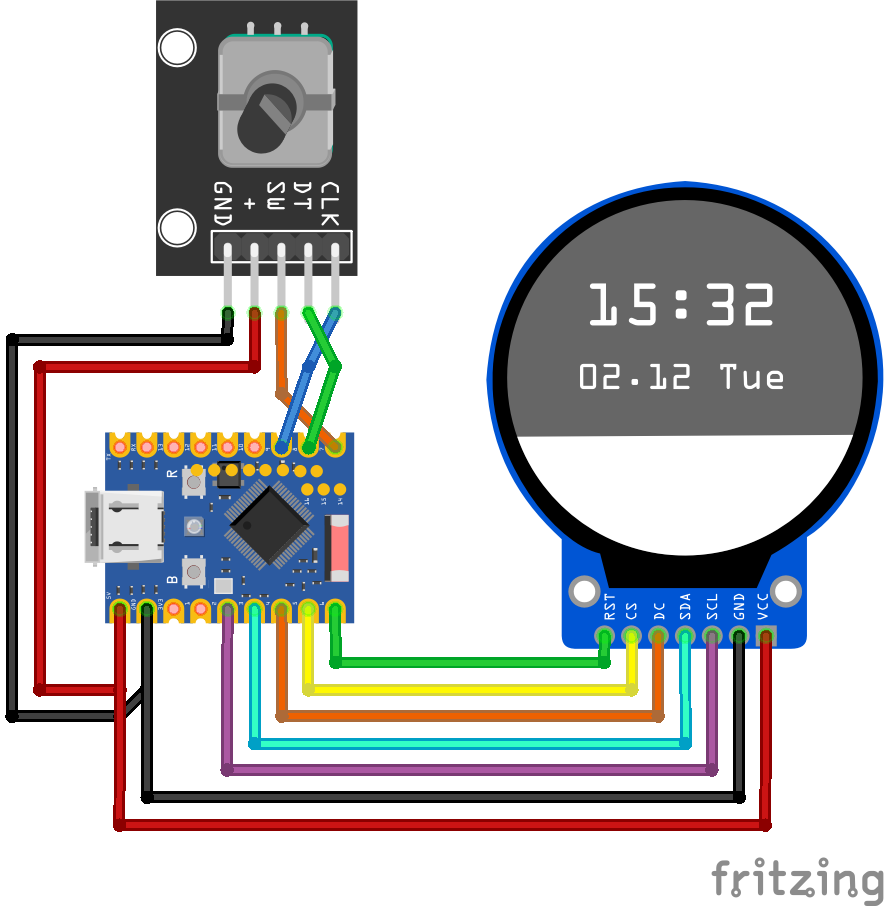
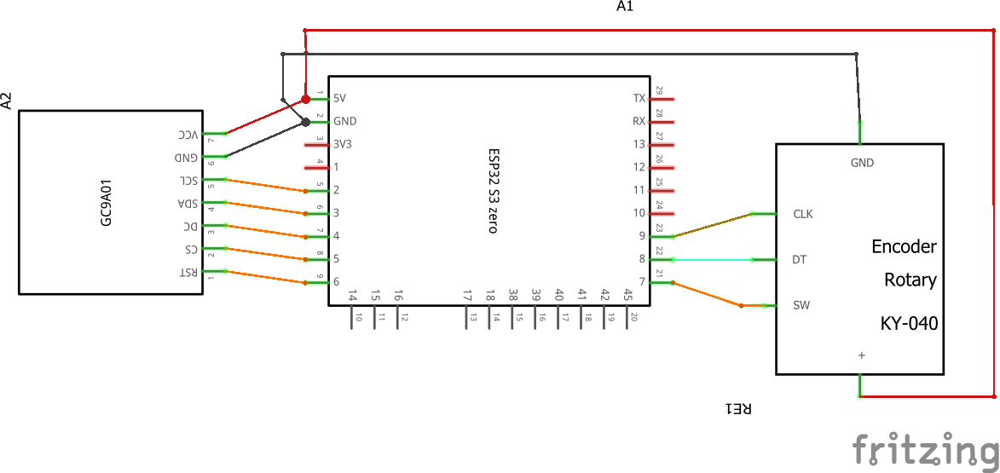

# Tech Talkies Internet Radio
### A live flight radar using nothing more than an ESP32-S3, a round display, and a rotary encoder.

Unlike most DIY flight radar projects, this version doesn't require complicated display boards or expensive modules. The ESP32 connects directly to the OpenSky Network API, downloads aircraft positions, and displays them on a smooth animated radar interface.

## Build Video:

---
## Features

- Live aircraft tracking
- Smooth radar sweep animation
- Aircraft movement prediction between updates
- Rotary encoder navigation
- Detailed aircraft information screen
- Multiple aircraft color coding
- Runs entirely on an ESP32-S3
- Simple and affordable hardware

---

## Hardware

- ESP32-S3 Zero
- 240x240 Round GC9A01 Display
- Rotary Encoder
- 3D printed parts

---

## Wiring

### GC9A01 240x240 Round Display
| ESP32-S3 Zero | Display |
|----------|----------|
|GP2|SCL |
|GP3|SDA |   
|GP4|DC |   
|GP5|CS |   
|GP6|RST |   
|5V|VCC |   
|GND|GND |   

### KY-040 Rotary Encoder

| ESP32-S3 Zero | KY-040 |
|---|---|
| GP9 | CLK |
| GP8 | DT |
| GP7 | SW |
| 5V | + |
| GND | GND |

---

---
## Setup

**1. Flash the firmware from the [Tech Talkies flasher page](https://techtalkies.github.io/flash.html).**

**2. Download the API credentials from [OpenSky](https://opensky-network.org/).**

**3. Connect to the `MicroRadar-Setup` Wi-Fi network and setup the connection.**

**4. Open ` http://microradar.local` from any device on the same network. If that doesn't work, check the serial monitor for the IP address and open that directly.**

---
##  Credits
This project is based on the excellent Micro Radar project by Anthony Sturdy and has been adapted and simplified for inexpensive ESP32 hardware. **Licenses from the library applies if you use this project.**

Original repo: https://github.com/AnthonySturdy/micro-radar
