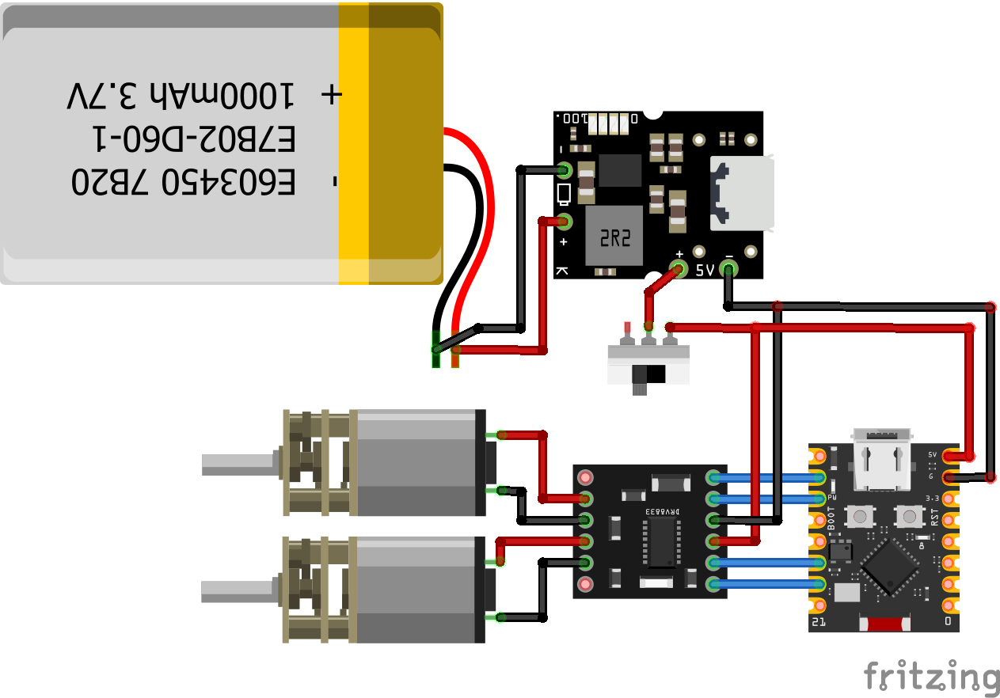

# TT Desk Tank

A tiny tracked desk robot built around an ESP32-C3, controlled entirely from a phone browser — no app required. It hosts its own Wi-Fi access point, serves a live web-based gamepad, and has an SH1106 OLED "face" that blinks on its own while you drive.

Built by [Tech Talkies](https://www.youtube.com/@techtalkies1).

[](https://ko-fi.com/techtalkies)   

## Build Video:
(Click image to view)

[](https://www.youtube.com/watch?v=umeCiPdUtFo)

---

## Features

- **Web-based gamepad** — connect to the robot's own Wi-Fi AP and drive it from any phone/laptop browser, no app install needed
- **Two drive modes**, controlled by a single joystick:
  - **Manual** — full 2D drive (forward/back + turn), speed slider caps max throttle
  - **Auto-forward** — robot cruises at the slider's fixed speed; the joystick locks to horizontal-only movement and becomes a pure left/right steering stick. Turning never changes the cruise speed — only the inner wheel slows down to steer
- **Universal speed slider** — sets cruise speed in Auto mode, caps max throttle in Manual mode
- **Flip L/R and Flip F/B switches** — fix reversed motor wiring or a mirrored control feel entirely in software, no rewiring needed
- **Animated OLED face** — blinks on a random interval, fully non-blocking (no `delay()`), so the animation never affects drive latency or web responsiveness
- **Connection failsafe** — motors auto-stop if no command is received for 400ms (e.g. you walk out of Wi-Fi range)

---

## Bill of Materials

| Part | Notes |
|---|---|
| ESP32-C3 Super Mini | Main controller (Wi-Fi + web server) |
| DRV8833 dual motor driver | Drives both N20 motors |
| 2× N20 gear motors | Drive wheels (front + rear on opposite sides) |
| SH1106 OLED, 128×64, I2C, 1.3" | Face display |
| LiPo cell + charge/boost module | USB charging with 5V boost output |
| 3D printed chassis | See `/hardware` for STL files |
| Silicone O-rings, 63mm OD × 3mm thick | Tank tracks |
| 2× ball bearings (624) | Idler wheel alignment (press fit) |
| M3 screws (12mm) + 2 hex nuts + 2 flat square nuts | Main chassis assembly |
| M2 screws (6x 3mm, 2x 5mm) | 4× PCB mount, 2× chassis mount piece, 2× charge module mount |

---

## Wiring

### Motor driver (DRV8833)
Both pins per motor are PWM-capable — direction and speed are set by PWMing one pin while holding the other at 0 duty. No separate enable pin needed.

| Signal | GPIO |
|---|---|
| Left motor forward (IN1) | 6 |
| Left motor reverse (IN2) | 7 |
| Right motor forward (IN3) | 10 |
| Right motor reverse (IN4) | 20 |

### OLED (SH1106, I2C)

| Signal | GPIO |
|---|---|
| SDA | 8 |
| SCL | 9 |

> Check your specific ESP32-C3 board's silkscreen — the C3 has no fixed I2C pins, so confirm before wiring.


---

## Software Setup

1. Install the **Arduino IDE** and the ESP32 board package (core 3.x — this sketch uses the newer `ledcAttach(pin, freq, res)` PWM API, not the old `ledcSetup`/channel-based one).
2. Install the **U8g2** library via Library Manager.
3. Open `DeskTank.ino`, select your ESP32-C3 board, and flash it.
4. Open the Serial Monitor at 115200 baud to confirm the OLED initializes and to see the AP's IP address on boot.

---

## Usage

1. Power on the robot.
2. On your phone, connect to the Wi-Fi network:
   - **SSID:** `TT Desk Tank`
   - **Password:** `TechTalkies`
3. Open a browser to `http://192.168.4.1`.
4. Drive:
   - Drag the joystick to drive manually.
   - Flip **AUTO FWD** on to cruise forward automatically — the joystick becomes steer-only.
   - Adjust the **Speed** slider to set cruise speed (Auto) or cap max throttle (Manual).
   - Use **Flip L/R** / **Flip F/B** if the robot drives backwards or mirrored relative to the joystick.

---

## Customizing

All the settings you're likely to want to change live at the top of the sketch:

```cpp
const char* AP_SSID     = "TT Desk Tank";
const char* AP_PASSWORD = "TechTalkies";

#define L_IN1 6
#define L_IN2 7
#define R_IN1 10
#define R_IN2 20

#define OLED_SDA 8
#define OLED_SCL 9
```

The full control web page (HTML/CSS/JS) is embedded in the sketch as a single `PROGMEM` string — edit the `PAGE_HTML` block to change the UI.

---

## Safety Note

When routing the battery wire through the chassis, you'll need to briefly disconnect the JST 2.0 connector. **Never let the exposed pins touch each other or any other electronics on the bench** — this is a LiPo battery, and a short circuit here is a genuine fire risk.

---

## License

MIT — see [LICENSE](LICENSE).

## Credits

Built by [Tech Talkies](https://www.youtube.com/@techtalkies1) — subscribe for the full build video and more ESP32 projects.
