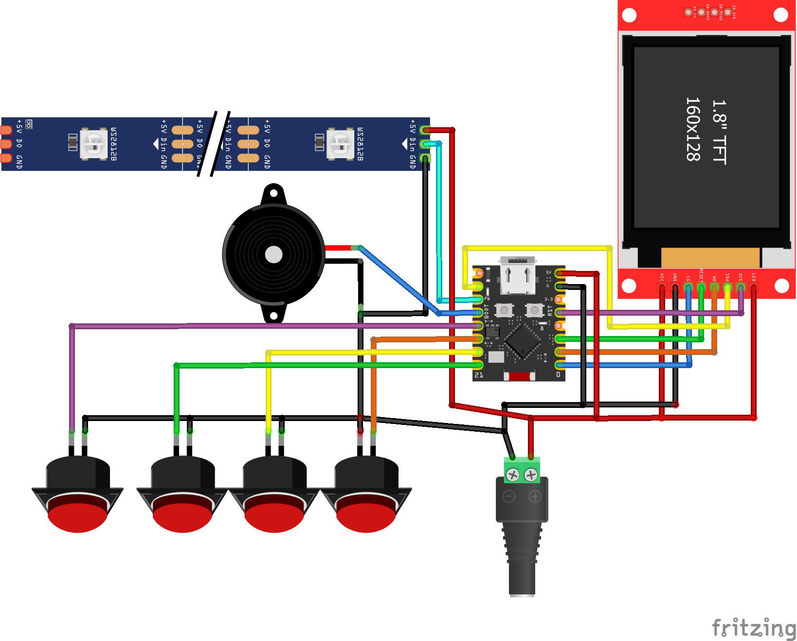
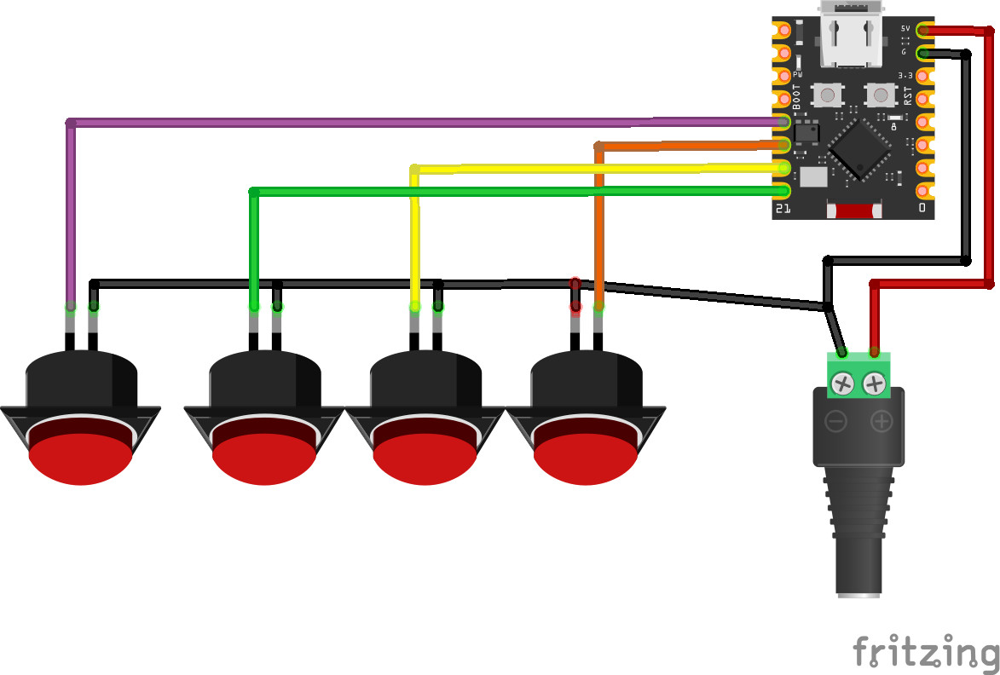
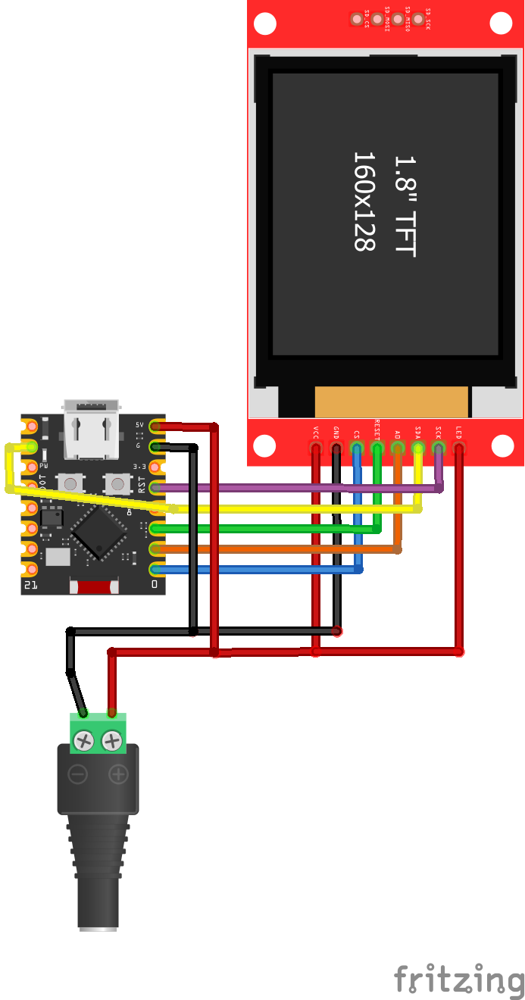
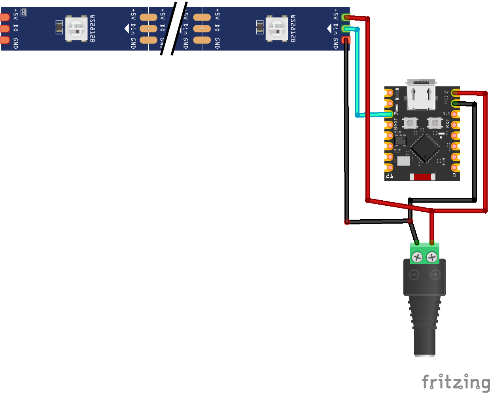

# 🎮 1D LED Game Console

[](https://ko-fi.com/techtalkies)   

Turn a simple WS2812 RGB LED strip into a handheld game console powered by an ESP32!

This project combines a 60-LED WS2812 strip, an ST7735 TFT display, four push buttons, and a buzzer to create a collection of fun one-dimensional games.

Designed as a beginner-friendly Arduino IDE project.

---

## 🎥 Demo

Watch the build and gameplay on the Tech Talkies YouTube channel.

[](https://www.youtube.com/watch?v=umeCiPdUtFo)

---

## Features

- 🎮 6 Built-in Games
- 🌈 WS2812 RGB LED gameplay
- 📺 ST7735 TFT menu and score display
- 🔊 Sound effects
- 🚀 ESP32 powered
- 📦 Arduino IDE compatible
- ⚡ Double-buffered TFT rendering (no screen flicker)
- 🔄 Instant game reset

---

## Games Included

- 👾 Space Invaders
- 🏃 Runner
- 🏓 Pong
- ⚡ Reaction
- 🧠 Memory
- 💪 Tug of War

---

## Hardware Required

| Component | Quantity |
|-----------|---------:|
| ESP32-C3 Super mini | 1 |
| WS2812B LED Strip | 60 LEDs |
| ST7735 SPI TFT Display | 1 |
| 16 mm Push Buttons | 4 |
| Passive Buzzer | 1 |
| USB C Panel Mount | 1 |

---

## Wiring

### TFT Display

| TFT | ESP32 |
|------|-------|
| SDA | MOSI (6)|
| SCL | SCK (4) |
| CS | 0 |
| A0 / DC | 1 |
| RST | 3 |
| VCC | 5V |
| GND | GND |

---

### Buttons

| Button | GPIO |
|---------|-----:|
| Left | 9 |
| Right | 20 |
| Select | 21 |
| Reset | 10 |

---

### LED Strip

| WS2812 | ESP32 |
|---------|------:|
| DIN | 7 |
| 5V | 5V |
| GND | GND |

---

### Buzzer

| Buzzer | ESP32 |
|---------|------:|
| + | GPIO 8 |
| - | GND |

---
## Circuit diagrams
Full diagram:


Individual components:





---

## Arduino Libraries

Install these from the Arduino Library Manager:

- FastLED
- Adafruit GFX Library
- Adafruit ST7735 and ST7789 Library

---

## Controls

### Menu

- **Left** → Previous game
- **Right** → Next game
- **Select** → Start game

### During Game

- **Reset** → Return to menu instantly

Each game uses the buttons differently.

---

## Rendering

The TFT display uses an off-screen **GFXcanvas16** framebuffer before updating the display.

Benefits:

- No visible flicker
- Smooth menu transitions
- Cleaner graphics
- Faster screen updates

---

## Project Structure

```
GameConsole.ino
```

Everything is contained in a single Arduino sketch for easy modification.

---

## Future Ideas

- More games
- High score saving
- Sound effects with speaker amplifier
- OLED version
- Multiplayer games
- NeoPixel matrix support
- TFT animations

---

## License

This project is released for personal and educational use.

If you build one, I'd love to see it!

---

## Credits

Created by **Tech Talkies**

📺 https://www.youtube.com/@techtalkies1

[](https://ko-fi.com/techtalkies)