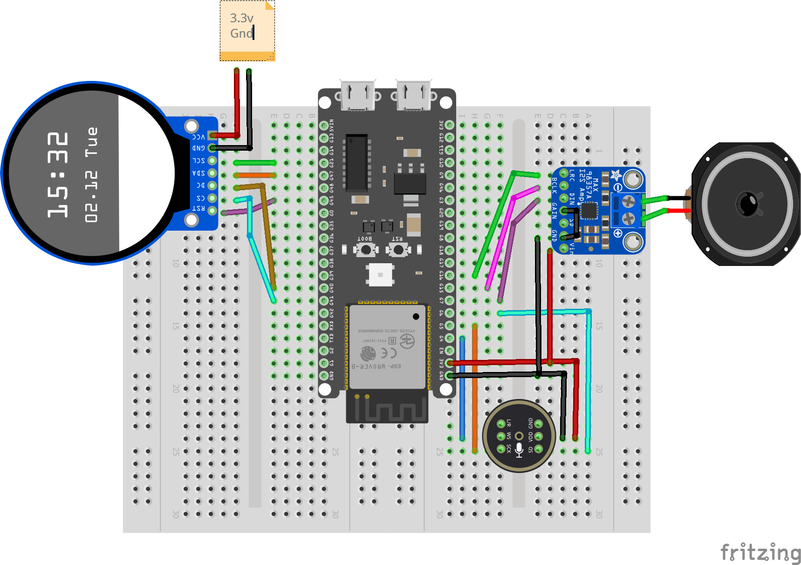

# AI Chatbot with face

   

A custom **XiaoZhi AI desk buddy** built around an **ESP32-S3** and a round **GC9A01 TFT display**.

This project started as a simple XiaoZhi voice-assistant desk buddy and evolved into a more character-like device with a custom animated face, audio-reactive speech animation, and hardware-specific firmware.

> **Important:** The custom face firmware in this repository is intended for the hardware configuration described below.

---

## 🎥 Demo

Watch the build and gameplay on the Tech Talkies YouTube channel.

---
## What We Changed

For this version, we:

- Added a custom animated face
- Added natural idle eye/gaze movement
- Added blinking and facial animation
- Added listening / thinking / speaking states
- Added audio-reactive mouth animation
- Added speech-text-driven mouth / viseme animation
- Added a semantic character-control layer

The goal is to make the device feel more like a little AI character sitting on your desk rather than a conventional status display.

## Hardware

- ESP32-S3 Dev Kit N16R8
- Round GC9A01 TFT
- INMP441 Microphone
- MAX98357A Amplifier
- 2W Speaker
- Breadboard x2

## Wiring

Use the following pin assignment for the hardware build used by this project.

### Microphone — INMP441 / ICS-43434 (I2S)

| ESP32-S3 Dev Board | Microphone |
|---|---|
| **GPIO 4** | **WS** — Word Select |
| **GPIO 5** | **SCK** — Data Clock |
| **GPIO 6** | **SD** — Data Output |
| **3V3** | **VDD** — Power Positive 3.3V |
| **GND** | **GND** — Ground |
| **GND** | **L/R** — Left/Right Channel — **Short** |

### Digital Amplifier — MAX98357A

| ESP32-S3 Dev Board | MAX98357A |
|---|---|
| **GPIO 7** | **DIN** — Digital Signal |
| **GPIO 15** | **BCLK** — Bit Clock |
| **GPIO 16** | **LRC** — Left/Right Clock |
| **3V3** | **Vin (or VCC)** — Power Input |
| **3V3** | **SD** — Shutdown Channel — **Short** |
| **GND** | **GND** — Ground |
| **GND** | **GAIN** — Gain and Channel — **Short** |
| — | **Audio+** → Speaker Positive (**usually the red wire**) |
| — | **Audio-** → Speaker Negative |

> For the speaker connections, use the correct polarity for your speaker. If the wire colors are unclear, check with the seller or use a multimeter.

### Display — SPI-LCD 8-Pin Interface

| ESP32-S3 Dev Board | Display |
|---|---|
| **GND** | **GND** — Ground |
| **3V3** | **VCC** — Power Positive |
| **GPIO 21** | **SCL** — Clock Line |
| **GPIO 47** | **SDA** — Data Signal |
| **GPIO 45** | **RES** — Reset |
| **GPIO 40** | **DC** — Data/Command Select |
| **GPIO 41** | **CS** — Chip Select |
| **GPIO 42** | **BLK** — Backlight |

> [!WARNING]
> **Check your board before wiring.**
>
> The GPIO numbers shown in the wiring diagram are specific to the **ESP32-S3 Dev Kit** used in the diagram. Different ESP32-S3 boards may have different pin layouts, labels, or onboard connections.
>
> **Always use the connection tables above as the authoritative wiring reference.** The diagram is provided for visual guidance only.
>
> If you are using a different ESP32-S3 board, **do not assume these connections are compatible**. Check your board's pinout and adapt the wiring accordingly.

## Getting Started

There are two useful ways to approach this project.

### 1. Start with the standard XiaoZhi firmware

Before using the custom port, verify that the hardware itself is working correctly.

Use the **[Xiaozhi firmware builder](https://xiaozhi.me/console/firmware-builder)** for your supported board and install the standard firmware.

This gives you a known-good baseline before moving to the custom firmware.

### 2. Try the Tech Talkies firmware with face

We built a separate hardware-specific port with a procedural animated face rendered directly on the GC9A01 TFT. Flash it from the [Tech Talkies flasher page.](https://techtalkies.github.io/flash.html)

To reproduce the exact device shown in the project:

1. Use the same hardware configuration.
2. Follow the wiring table above.
3. Use the custom firmware port from this repository.

## Credits

This project builds on:

- [XiaoZhi](https://github.com/78/xiaozhi-esp32)

The custom face, animation system, hardware port, and integration work are developed specifically for this project.

## License

Check the licenses of the upstream XiaoZhi, ESP-IDF, LVGL, and other dependencies before redistributing modified firmware or source.

Add the license for this repository here.

## Notes

This is an experimental hardware/software project.

The custom face is designed around the specific display and board configuration used in this build. It is not currently intended to be a universal drop-in UI for every XiaoZhi-supported board.

If you want the exact character shown in the project/demo, use the same hardware configuration and the custom port provided here.
