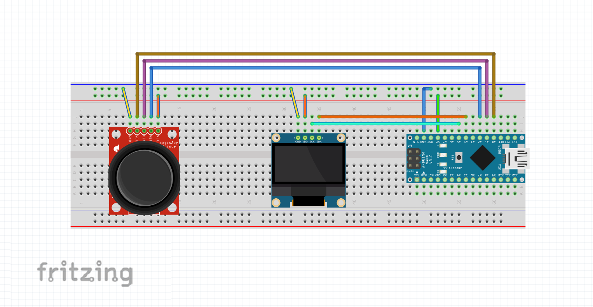

# Robot eyes - a Beginner Arduino Project
This page contains the code and supporting libraries for the below video. 
It is a video demonstrating an Arduino nano project to make robot eyes on an OLED display. The eyes can be controlled with a joystick module. 

Video link:

# Libraries:

1. Adafruit_GFX
2. Adafruit_SSD130

# Connections:
Connect power pins accordingly

**Display**
1. SDA -> A4
2. SCL -> A5

**Joystick**
1. VRX -> A1
2. VRY -> A2
3. SW -> A0

**Connection diagram done using Fritzing (https://fritzing.org/)**

