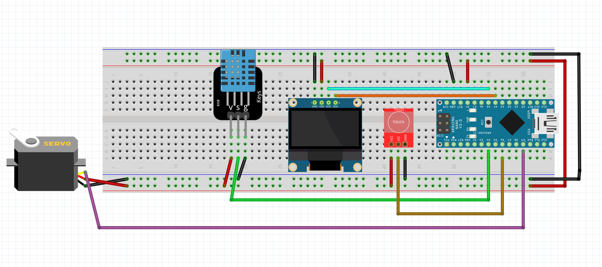

# RGB Pixel Sand | Raspberry Pi Pico Project | With code
This page contains the code and supporting libraries for the below video. 
It is a video demonstrating A Raspberry Pi Pico project, using Circuit Python. It is pixel sand that is controlled by an MPU6050 gyroscope module. It is rendered on a 64x32 RGB matrix panel.

Video link:

# Libraries:

1. Adafruit_GFX (https://github.com/adafruit/Adafruit-GFX-Library)
2. Adafruit_SSD130 (https://github.com/adafruit/Adafruit_SSD1306)
3. Servo (https://docs.arduino.cc/libraries/servo/)
4. DHT11 (https://github.com/adafruit/DHT-sensor-library)

# Connections:
Connect power pins accordingly

1. DHT11: S -> D4
2. Touch: IO -> D6
3. Servo -> D9
4. Display SDA -> A4
5. Display SCL -> A5

**Connection diagram done using Fritzing (https://fritzing.org/)**

