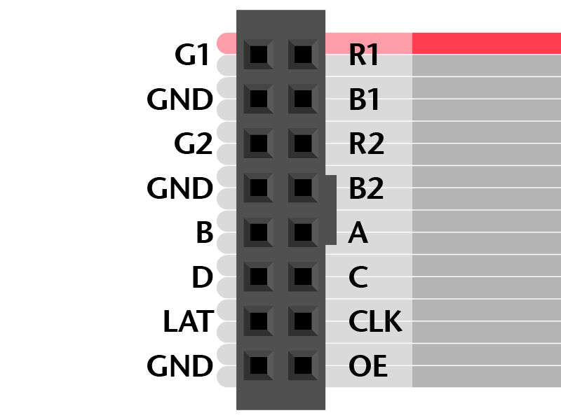
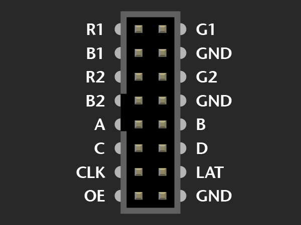

# Arduino Temperature & Humidity Gauge
This page contains the code and supporting libraries for the below video. 
It is a video demonstrating an Arduino nano project to make a smart temperature and humidity gauge. It is a beginner friendly project with code.

Video link:

# Libraries:

1. Thonny - https://thonny.org/

# Connections:
Connect power pins accordingly

| 	MPU6050   |    Pico       |
| ------------- | ------------- |
|      SDA       |     GP18       |
|      SCL       |     GP19       |

| 	RGB Panel   |    Pico       |
| ------------- | ------------- |
|      R1       |     GP2       |
|      G1       |     GP3       |
|      B1       |     GP4       |
|      R2       |     GP5       |
|      G2       |     GP6       |
|      B2       |     GP7       |
|      A       |     GP8       |
|      B       |     GP9       |
|      C       |     GP10       |
|      D       |     GP11       |
|      CLK       |     GP12       |
|      LAT       |     GP13       |
|      OE       |     GP14       |

    

