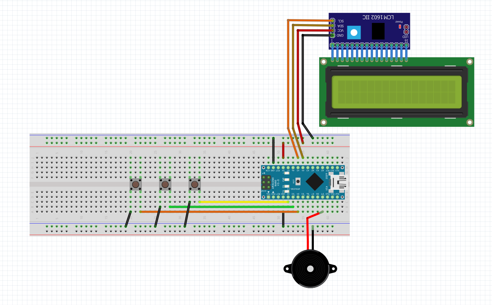

# Christmas Carol Machine | Easy Arduino Project | With code
This page contains the code and supporting libraries for the below video. 
It is a video demonstrating A simple, beginner friendly Christmas Arduino Project. We select and play Christmas songs on a buzzer. Using an LCD display for selecting and displaying songs.

Video link:

# Libraries:

1. LCD - https://github.com/johnrickman/LiquidCrystal_I2C
2. Base project code from - https://github.com/robsoncouto/arduino-songs
3. Christmas songs for buzzer from - https://github.com/jwolle1/arduino_christmas_music

# Connections:
Connect power pins accordingly

| 	Component   |    Nano       |
| ------------- | ------------- |
|      LCD SDA       |     A4       |
|      LCD SCL       |     A5       |
|      Button 1       |     D2       |
|      Button 2       |     D3       |
|      Button 3       |     D4       |
|      Buzzer       |     D9       |

    

