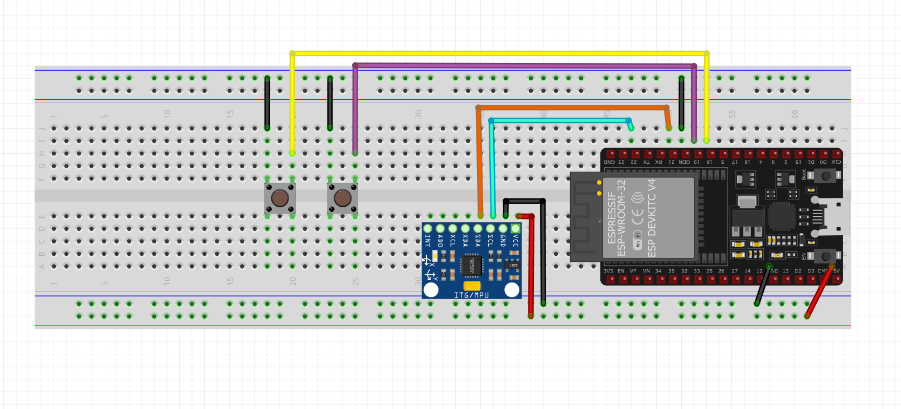

# 48 ESP32 Air Mouse | Arduino project with code
This page contains the code and supporting libraries for the below video. 
It is an Arduino project using ESP32 and MPU6050 gyro / accelerometer sensor module to make an air mouse. It uses the gyro to sense the position of the hand to control the mouse curse on any device. Windows and Android are both supported. Using the libraries - Adafruit MPU6050 and Blemouse.

Video link:

# Libraries:

1. ESP32-BLE-Mouse - https://github.com/sirfragles/ESP32-BLE-Mouse
2. Adafruit MPU6050 - https://github.com/adafruit/Adafruit_MPU6050
   
# Connections:
Connect power pins accordingly

| 	Component   |    ESP32       |
| ------------- | ------------- |
|      MPU6050 SDA     |     GPIO21       |
|       MPU6050 SCL     |     GPIO22       |
|      Button 1      |     GPIO18       |
|      Button 2      |     GPIO19       |

