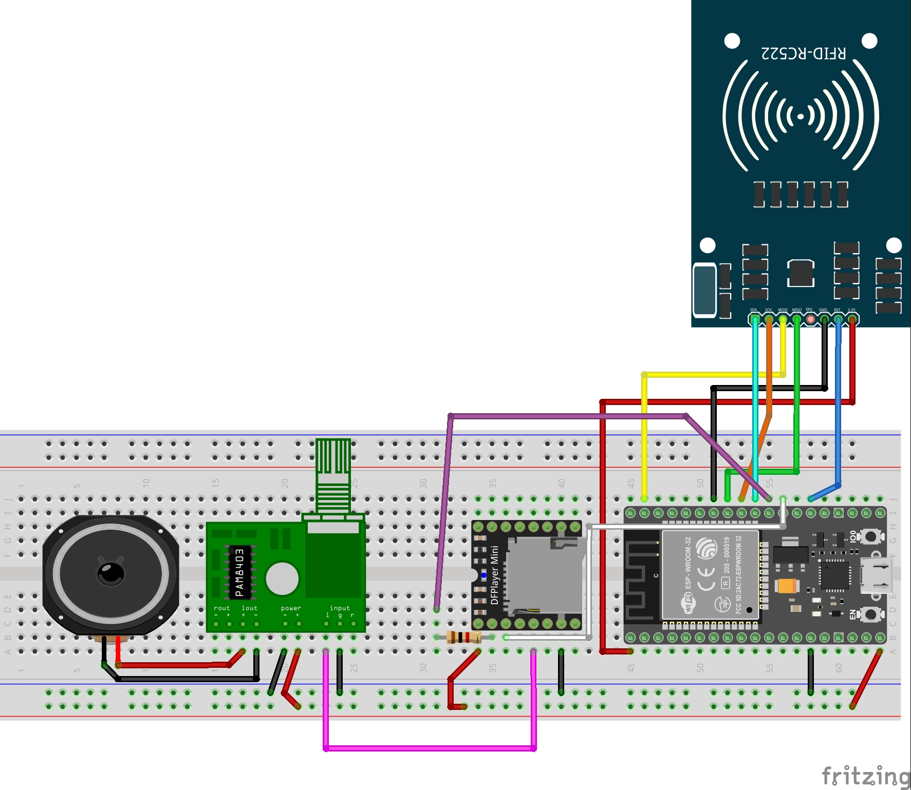

# RFID Access System with Voice Feedback

This project is an RFID-based access control system powered by an ESP32, featuring voice feedback using the DFPlayer Mini MP3 module. Upon scanning RFID cards, the system plays pre-recorded audio saying either "Access Granted" or "Access Denied". Ideal for DIY security setups or educational demonstrations.

Video link:

## Connections

### RFID Module to ESP32

| RFID Module | ESP32 Pin |
|-------------|-----------|
| VCC         | 3.3V      |
| RST         | D0        |
| GND         | GND       |
| MISO        | 19        |
| MOSI        | 23        |
| SCK         | 18        |
| SDA         | 5         |

### DFPlayer Mini MP3 Module to ESP32

| MP3 Module | ESP32 Pin         |
|------------|-------------------|
| VCC        | 5V                |
| GND        | GND               |
| RX         | 1kΩ resistor to 17 |
| TX         | 16                |

### PAM8403 Amplifier to DFPlayer Mini

| PAM8403 Pin | Connection     |
|-------------|----------------|
| Power +     | 5V             |
| Power –     | GND            |
| Input L     | ADC 1 (from MP3) |
| Input G     | GND            |

## Circuit Diagram

## Libraries Used

- [`DFRobotDFPlayerMini`](https://github.com/DFRobot/DFRobotDFPlayerMini)
- [`RFID (MFRC522)` by miguelbalboa](https://github.com/miguelbalboa/rfid)
