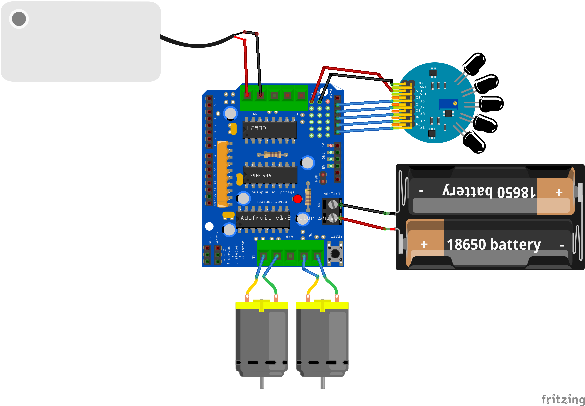

# 🔥 Fire Fighting Robot using Arduino

This is a beginner-friendly Arduino project where a simple robot detects fire using flame sensors, moves toward it, and sprays water using a pump and servo motor. Ideal for learning about sensor arrays, motor control, and automation.

---

## 🧰 Components Used

- Arduino Uno or Nano  
- Adafruit Motor Shield v1  
- 2x DC Motors with Wheels  
- 5V Mini Water Pump  
- Servo Motor (for sweeping spray)  
- 5-Channel Flame Sensor (or 3+ individual flame sensors)  
- Robot Chassis with Caster Wheel  
- Battery Pack (6x AA or similar)

---

---

## ⚙️ How It Works

- The flame sensors continuously scan for infrared radiation.
- The robot turns toward the direction of the strongest signal.
- When the central sensor detects a strong flame, it moves closer.
- Once near, it activates the water pump and sweeps the servo to spray water.
- If no flame is detected, it stops all movement and spraying.

---

## 🔌 Wiring Overview

| Component         | Connection                         |
|------------------|-------------------------------------|
| Flame Sensors     | A0 to A4 (analog pins)              |
| DC Motors         | Motor Shield M1 & M2                |
| Pump Motor        | Motor Shield M3 or M4               |
| Servo Motor       | Motor Shield Pin 9 (Servo header)   |
| Power             | Separate motor power recommended    |

*Ensure the grounds of motor power and Arduino are connected.*

---

## 🧠 Code

- `fire_fighting_robot.ino` contains the full Arduino sketch.
- Adjust `flameThreshold` and servo sweep angles as needed.

---

## 🚫 Limitations

- Not suitable for outdoor use — flame sensors are IR-based and can be overwhelmed by sunlight.
- Works best in low-light indoor conditions.

---

## 📸 Demo & Video

Watch the full build and demo on YouTube:  
👉 [Tech Talkies YouTube](https://youtu.be/jvt2KyTrqXQ)

---

## 📝 License

MIT License  
Feel free to use, modify, and share — just give credit.

---

## 🌐 Website

Visit [TechTalkies.in](https://techtalkies.in/) for more projects.
