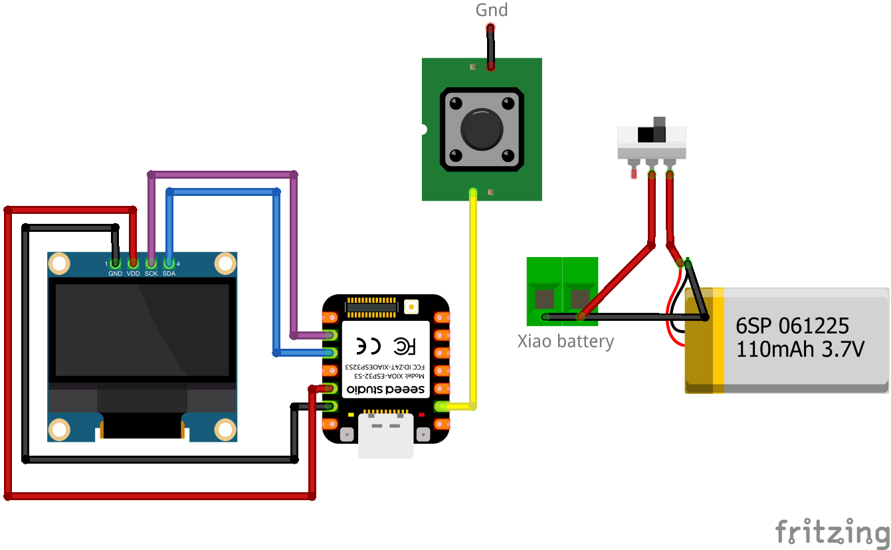

# Portable OLED Device With Flashable Mini Apps And Games

This project turns the Seeed Studio XIAO nRF52840 Sense (or compatible board) into a mini handheld gadget capable of running multiple small apps and games — each one flashable as a standalone firmware.

It uses an OLED display, onboard sensors, and a single button for control, allowing you to quickly experiment with compact embedded experiences like a maze game, flappy bird, dB meter, Bluetooth scanner, and more.

## 💸 Get Your nRF52840 at a Discount

[🛒 Buy the Seeed XIAO nRF52840 from Seeed Studio](https://www.seeedstudio.com/Seeed-Studio-XIAO-nRF52840-Sense-Plus-p-6360.html?sensecap_affiliate=P9GHEkF&referring_service=link)

Use promo code **`N891LZX6`** at checkout for a discount!

---

---

## 🎥 Video Demo + Tutorial

📺 [Watch the full video tutorial here](https://www.youtube.com/watch?v=g_ywjXrnEu0)

---

## 🔧 Hardware Required

| Component                  | Notes                          |
|---------------------------|---------------------------------|
| Seeed Xiao nRF52840       | Onboard IMU and Mic             |
| LiPo batter               | Connects directly to Xiao       |
| Zero PCB / Breadboard     | For wiring                      |
| Jumper Wires              | Connect SDA, SCL, 3.3V, GND     |
| Optional: 3D printed Case | With screw inserts              |

---

## 🔌 Wiring

| OLED pins          | Connect to Xiao nRF52840|
|--------------------|-------------------------|
| SDA                | D4                      |
| SCL                | D5                      |
| VCC                | 3.3V                    |
| GND                | GND                     |

---
## 🔧 Circuit diagram

