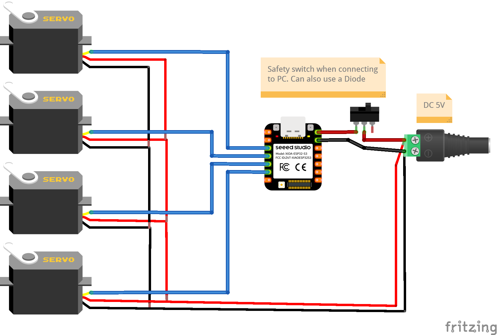

# ESP32 Web-Controled Robotic Arm

A mobile-controlled robotic arm built using an ESP32 and standard hobby servos.  
The arm is controlled directly from a web browser, no mobile app required.

The ESP32 runs as a Wi-Fi access point and hosts a lightweight HTTP web interface with sliders and buttons to control each joint in real time.

---

## 💸 Get Your ESP32S3 at a Discount

[🛒 Buy the Seeed XIAO ESP32S3 from Seeed Studio](https://www.seeedstudio.com/XIAO-ESP32S3-p-5627.html?sensecap_affiliate=P9GHEkF&referring_service=link)

Use promo code **`N891LZX6`** at checkout for a discount!

---

## Features

- Web-based control (works on any phone or laptop)
- No external PWM driver board (no PCA9685)
- Hardware PWM using ESP32
- Smooth motion using target vs current angle control
- Reset / home function
- Optional vertical slider lock mode
- Designed for 2S Li-ion battery operation

---

## Hardware Used

- Xiao ESP32S3
- 4× Servo motors (MG90S or SG90)
  - Left–Right (Base)
  - Forward–Backward
  - Up–Down
  - Gripper
- External 5V supply (Regulated)

---

## Pin Configuration

| Function           | Board Label | GPIO |
|--------------------|------------|------|
| Left–Right         | D2         | 3    |
| Forward–Backward   | D3         | 4    |
| Up–Down            | D4         | 5    |
| Gripper            | D5         | 6    |

## 🔧 Circuit diagram

---
Click on image for the video:

---

